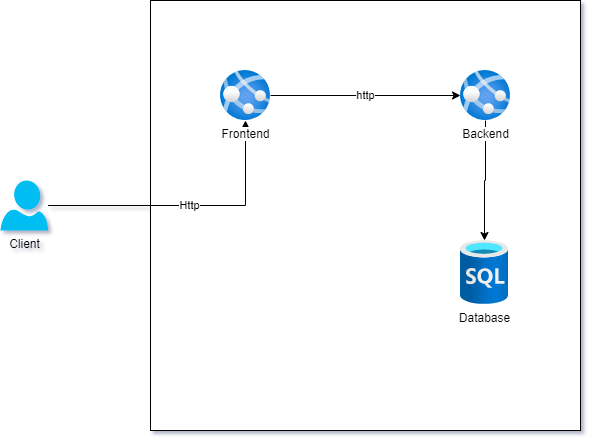

# Introdução

Este é um projeto que implementa um backend e um frontend onde o objetivo será apresentar uma página ao usuário contendo botões que o direcionam pra diversos links.

# Tecnologias utlizadas

- .net 5.0
- Visual Studio Code

# Design Basico



# Targets

- [x] Criação do projeto backend
- [x] A implementação inicial do domínio
- [x] Interface de repository
- [ ] Integração com o banco de dados
- [ ] Implementar o frontend
- [ ] implementação dos scripts de infraestrutura
- [ ] CI/CD


## Criação do backend

Para criar um backend digite o seguinte comando no terminal:

```bash
dotnet new webapi --name MyLinks.API 
```

